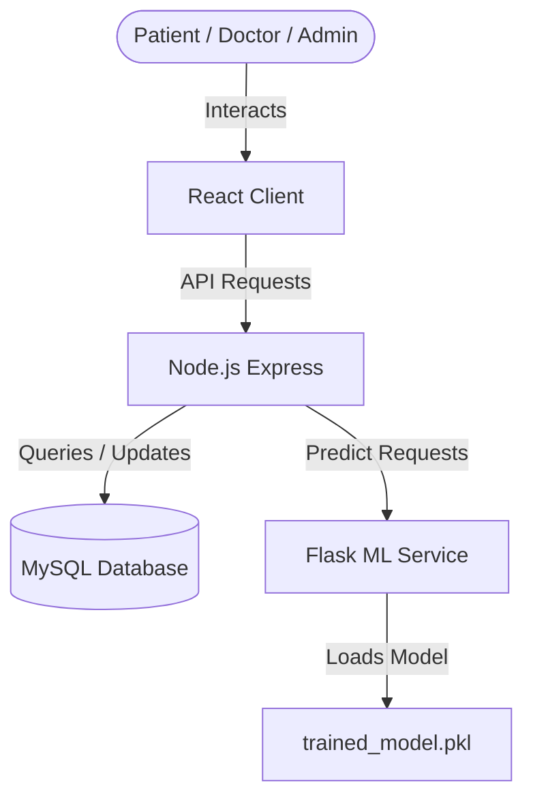

# MediQueue Deployment Guide

This guide describes how to deploy the entire MediQueue Hospital Queue Optimization system, which consists of:
1. **Database**: MySQL database (stores appointments, check-ins, users).
2. **ML Service**: Python Flask API (predicts wait times using a Random Forest model).
3. **Backend**: Node.js Express Server (manages authentication, queue state, bookings, and emails).
4. **Frontend**: React SPA (user and staff dashboard interfaces).

---

## 🏛️ System Architecture



---

## 1. Database Setup (MySQL / TiDB Cloud)

You need a MySQL database instance. You can host this using services like **TiDB Cloud** (recommended serverless MySQL), **Clever Cloud**, **Aiven**, **Railway**, or standard MySQL 8.0+.

1. Create a database named `mediqueue` and retrieve your credentials:
   - **Host** (e.g. `gateway01.ap-southeast-1.prod.aws.tidbcloud.com` or `localhost`)
   - **Port** (usually `4000` for TiDB Cloud, `3306` for MySQL)
   - **User**
   - **Password**
   - **Database Name** (`mediqueue`)
   - **SSL Requirement** (Set `DB_SSL=true` for cloud providers requiring TLS)

2. Import the database schema:
   - **For MySQL 8.0+ or TiDB Cloud (Recommended)**:
     ```bash
     mysql -u <user> -p -h <host> -P <port> --ssl-mode=REQUIRED <database_name> < database/schema_fixed.sql
     ```
   - **For standard MySQL 5.7+ / MariaDB / Clever Cloud**:
     ```bash
     mysql -u <user> -p -h <host> -P <port> <database_name> < database/schema.sql
     ```
   *(Alternatively, execute the SQL file directly via DBeaver, MySQL Workbench, or your cloud provider web console).*

---

## 2. ML Service Deployment (Python Flask)

The Machine Learning service provides sub-15ms wait time forecasting using a pre-trained Random Forest model and includes an automated continuous retraining pipeline (`retrain.py`).

* **Hosting Recommendations**: Render (Web Service), Railway, or Docker.
* **Root Directory**: `mediqueue/ml-service`
* **Runtime**: Python 3.10 / 3.11
* **Build Command**: `pip install -r requirements.txt`
* **Start Command**: `gunicorn app:app --bind 0.0.0.0:$PORT`
* **Port**: Automatically assigned by platform via `$PORT` (defaults to `5001` locally).

### Environment Variables:
| Variable | Required | Description | Example |
| :--- | :---: | :--- | :--- |
| `PORT` | No | Flask HTTP port | `5001` |
| `DB_HOST` | **Yes** | Database host (for retraining pipeline) | `gateway01.tidbcloud.com` |
| `DB_PORT` | No | Database port | `4000` (TiDB) or `3306` |
| `DB_USER` | **Yes** | Database username | `root` |
| `DB_PASSWORD` | **Yes** | Database password | `<your_db_password>` |
| `DB_NAME` | **Yes** | Database name | `mediqueue` |
| `ML_INTERNAL_SECRET` | **Yes** | Shared secret token guarding `POST /retrain` | `<random_token_32_chars>` |

### Continuous Retraining Setup:
- **Nightly Retraining via Cron / Render Cron Job**:
  You can run a daily cron at midnight:
  ```bash
  python retrain.py
  ```
- **Webhook / API Trigger**:
  Send an authenticated `POST` request to reload model weights on demand:
  ```bash
  curl -X POST https://your-ml-service.onrender.com/retrain \
    -H "Authorization: Bearer <ML_INTERNAL_SECRET>"
  ```

---

## 3. Backend Deployment (Node.js Express + Socket.io)

The backend acts as the central coordinator, handles WebSocket rooms for live queue broadcasts, communicates with the ML microservice, and executes nightly dynamic slot recalculation.

* **Hosting Recommendations**: Render (Web Service), Railway, or VPS.
* **Root Directory**: `mediqueue/backend`
* **Build Command**: `npm install`
* **Start Command**: `npm start`
* **Port**: Render/Railway injects dynamic `$PORT` (defaults to `5000` locally).

### Environment Variables:
Configure the following in your deployed backend service:

| Variable | Required | Description | Example / Default |
| :--- | :---: | :--- | :--- |
| `NODE_ENV` | No | Environment mode | `production` |
| `PORT` | No | HTTP listening port | `5000` |
| `DB_HOST` | **Yes** | MySQL / TiDB host address | `gateway01.tidbcloud.com` |
| `DB_PORT` | No | Database port | `4000` or `3306` |
| `DB_USER` | **Yes** | Database username | `root` |
| `DB_PASSWORD` | **Yes** | Database password | `<your_db_password>` |
| `DB_NAME` | **Yes** | Database name | `mediqueue` |
| `DB_SSL` | No | Cloud TLS SSL flag (`true` for TiDB/Aiven) | `true` |
| `ML_SERVICE_URL` | **Yes** | URL of deployed Flask ML service | `https://your-ml-service.onrender.com` |
| `ML_INTERNAL_SECRET`| No | Shared secret token matching ML service | `<random_token_32_chars>` |
| `FRONTEND_URL` | **Yes** | Allowed client origin for CORS whitelist | `https://frontend-phi-ruby-62.vercel.app` |
| `EMAIL_USER` | **Yes** | Gmail account for OTPs & confirmations | `your-email@gmail.com` |
| `EMAIL_PASS` | **Yes** | 16-character Google App Password | `xxxx xxxx xxxx xxxx` |
| `JWT_SECRET` | **Yes** | Secret for signing JSON Web Tokens | `any-random-long-string-min-32-chars` |

---

## 4. Frontend Deployment (React 18 SPA)

The frontend client is built as an optimized static Single Page Application with mobile-first responsiveness and hosted on Vercel.

* **Hosting Recommendation**: Vercel (Production URL: `https://frontend-phi-ruby-62.vercel.app`).
* **Root Directory**: `mediqueue/frontend`
* **Framework Preset**: Create React App
* **Build Command**: `npm run build`
* **Output Directory**: `build`
* **SPA Routing**: Handled automatically via `frontend/vercel.json` rewrites.

### Setup on Vercel:
1. Import the repository into Vercel.
2. Set **Root Directory** to `mediqueue/frontend`.
3. Add Build Environment Variable:
   - `REACT_APP_API_URL`: Set to your deployed backend URL (e.g., `https://your-backend.onrender.com/api`).
4. Click **Deploy**.

---

## ⚡ Verifying Your Deployment

1. **ML Service Heartbeat**:
   Visit `https://your-ml-service.onrender.com/health` in your browser. It should return:
   ```json
   {
     "status": "OK",
     "model_loaded": true,
     "service": "MediQueue ML Service",
     "features": [
       "department_id", "time_slot", "day_of_week", "month", "is_weekend",
       "current_queue_length", "providers_on_shift", "nurses_on_shift",
       "staff_ratio", "is_emergency", "patient_age", "reason_complexity_score",
       "is_online_booking", "occupancy_rate"
     ]
   }
   ```

2. **ML Prediction Verification**:
   Test wait time inference:
   ```bash
   curl -X POST https://your-ml-service.onrender.com/predict-wait \
     -H "Content-Type: application/json" \
     -d '{"department_id": 2, "current_queue_length": 4, "providers_on_shift": 3, "patient_age": 42}'
   ```
   Should return: `{"success": true, "predicted_wait_minutes": 25, "load_level": "Medium", ...}`

3. **Backend Status**:
   Visit `https://your-backend.onrender.com/health` or inspect deployment startup logs:
   ```text
   🏥 MediQueue Backend — port 5000
   🌐 NODE_ENV: production
   📡 Socket.io ready
   ✅ Database connected
   ```

4. **Frontend Verification**:
   Navigate to your Vercel URL (`https://frontend-phi-ruby-62.vercel.app`), verify the live OPD ticker, 2x2 quick matrix on mobile view, and test creating an appointment booking with instant QR pass generation.
