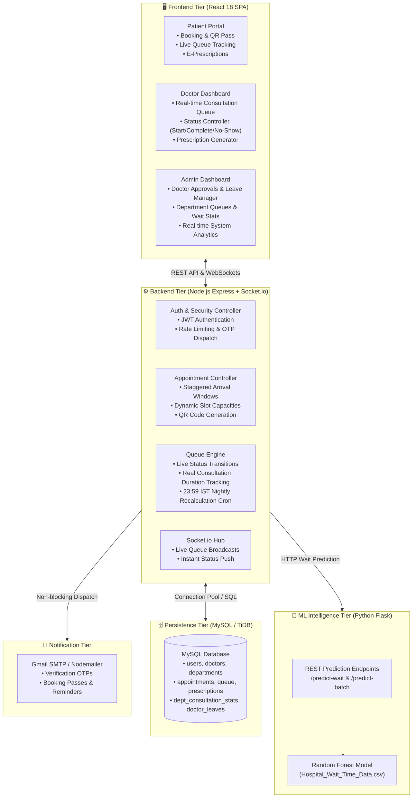
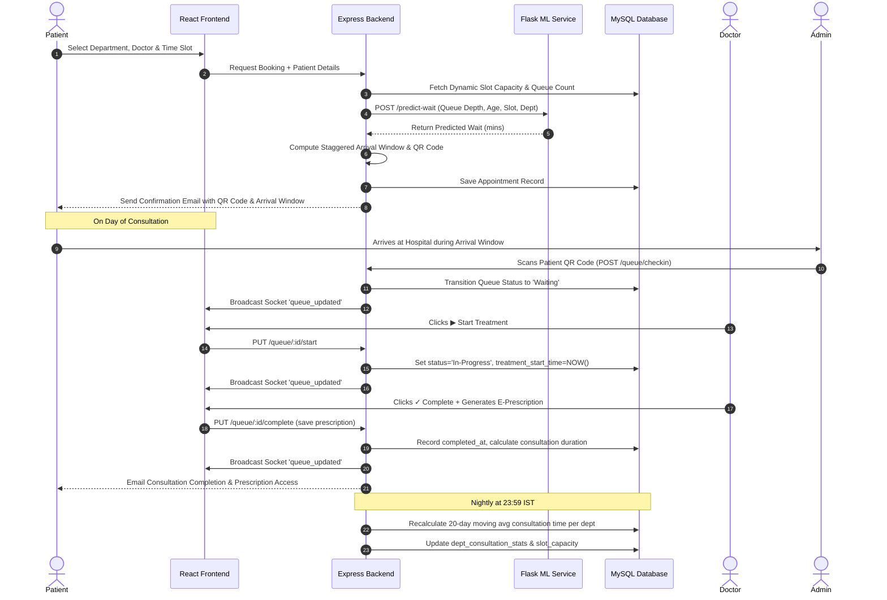

<div align="center">

# 🏥 MediQueue
### Smart AI-Powered Hospital Queue Optimization & Appointment Platform

[](https://nodejs.org/)
[](https://reactjs.org/)
[](https://flask.palletsprojects.com/)
[](https://python.org/)
[](https://mysql.com/)
[](https://socket.io/)
[](LICENSE)

*An intelligent multi-tier healthcare orchestration platform that eliminates waiting room congestion, reduces patient waiting times, prevents physician burnout, and delivers live digital queue tracking.*

[Features](#-key-features) • [Architecture](#-system-architecture) • [Workflow](#-end-to-end-workflow) • [Machine Learning](#-machine-learning--smart-queue-engine) • [Installation](#-getting-started) • [API Reference](#-api-endpoints) • [Deployment](#-deployment)

</div>

---

## 📖 Overview

Traditional hospital outpatient workflows suffer from unpredictable arrival surges, static slot allocations, and crowded waiting rooms. **MediQueue** solves this through:

1. **AI-Driven Wait Time Forecasting**: A Random Forest regression model trained on real-world clinical wait-time records estimates dynamic wait periods before arrival.
2. **Dynamic Slot Capacities & Staggered Arrival Windows**: Automatically sizes 2-hour consultation slots based on empirical doctor consultation times and gives each patient a customized arrival window (~30 minutes before expected turn), preventing peak-hour waiting room overcrowding.
3. **Live Digital Queue Synchronization**: Real-time WebSockets (Socket.io) propagate queue progression instantly to waiting area screens and patient mobile devices.
4. **Touchless QR Check-Ins**: Instant contactless arrival verification upon entering the hospital premises.
5. **Integrated Clinical Suite**: End-to-end management for e-prescriptions, doctor leaves, role-based dashboards, and hospital analytics.

---

## 🏛️ System Architecture



---

## 🔄 End-to-End Workflow



---

## ✨ Key Features

### 👤 Patient Experience
- **Frictionless Booking**: Browse hospital departments, doctor profiles, availability schedules, and available 2-hour slots.
- **Staggered Arrival Windows**: Personalized arrival recommendations (~30 minutes before appointment) to eliminate physical waiting room crowds.
- **Digital Health Pass**: Instant generation of QR codes containing verified booking tokens.
- **Real-Time Token Tracking**: Watch your token position update live without refreshing the browser.
- **E-Prescriptions**: Directly view and store digital prescriptions issued by consulting physicians.
- **Automated Alerts**: Email notifications for registration OTP, appointment confirmation, check-in, and completion.

### 🩺 Doctor Suite
- **Interactive Live Queue**: Clean, synchronized dashboard showing all checked-in patients in order of arrival.
- **Action Controls**: Simple one-click progression (`▶ Start`, `✓ Complete`, `✕ Mark No-Show`).
- **Precision Duration Tracking**: System captures true patient interaction duration (`completed_at - treatment_start_time`), filtering out idle queue time.
- **E-Prescription Builder**: Built-in modal to prescribe medications, dosage instructions, and diagnostic notes.
- **Leave Management**: Self-service time-off requests automatically blocking patient booking slots for affected dates.

### 🛡️ Hospital Administration & Operations
- **Doctor Approval Pipeline**: Review newly registered practitioners before granting clinical access.
- **Department Overviews**: Monitor patient flow, doctor active status, and live queue velocity across all hospital wings.
- **Dynamic Capacity Control**: Inspect machine learning averages (`avg_consultation_mins`) and adjusted slot capacities per department.
- **Master Scheduling**: Full visibility over today's appointments, upcoming schedules, and manual doctor leave overrides.
- **Contactless Reception Scanning**: QR scanner to check-in arriving patients instantly.

---

## 🧠 Machine Learning & Smart Queue Engine

### 1. Predictive Wait Time Regression
The ML microservice utilizes a **Random Forest Regressor** trained on clinical outpatient datasets (`Hospital_Wait_Time_Data.csv`) factoring in:
- Department historical consultation metrics
- Time of day & slot congestion
- Current queue depth and backlog
- Patient age and clinical complexity score
- Emergency bypass weighting

### 2. Dynamic Slot Capacity Formula
Instead of arbitrary scheduling limits, MediQueue dynamically recalculates slot limits:
$$\text{Slot Capacity} = \left\lfloor \frac{120 \text{ minutes}}{\text{avg\_consultation\_mins}} \right\rfloor$$

*Example*: If Cardiology consultations average **24 minutes**, the system caps bookings at **5 patients per 2-hour slot**. If Pediatrics averages **15 minutes**, the slot capacity expands to **8 patients**.

### 3. Self-Healing Moving-Window Aggregator
Every midnight at **23:59 IST**, a background task executes the following self-correction:
- Pulls all verified consultations within the last **20-day window**.
- Applies strict outlier rejection (excluding sessions $< 5$ min as accidental clicks and $> 60$ min as doctor system oversights).
- Updates `dept_consultation_stats` with new empirical averages and updated slot capacities.
- **Resilient Fallback**: If the ML service is temporarily unreachable, the backend gracefully computes queue wait estimates directly from the database stats table without failing the booking.

---

## 🗂️ Standard Repository Structure

```
mediqueue/
├── backend/                           # Node.js Express REST API & Socket.io Server
│   ├── controllers/                   # Route business logic (Auth, Queue, Appt, Admin)
│   ├── middleware/                    # JWT Auth & Role Verification
│   ├── models/                        # MySQL connection pool configuration
│   ├── routes/                        # Unified API route declarations
│   ├── socket/                        # Socket.io event handlers & real-time rooms
│   ├── utils/                         # Email dispatcher & ML client
│   ├── .env.example                   # Backend environment configuration template
│   ├── .gitignore                     # Backend-specific ignore rules
│   ├── package.json                   # Dependencies and scripts
│   ├── server.js                      # Server entry point & startup diagnostics
│   └── testEmail.js                   # SMTP diagnostic utility
├── database/                          # Relational Database Schema & Migrations
│   ├── schema.sql                     # Full MySQL schema & initial seed data
│   ├── schema_fixed.sql               # MySQL 8.0+ / TiDB collation compatible schema
│   └── README.md                      # Database setup & schema documentation
├── frontend/                          # React 18 Single Page Application
│   ├── public/                        # Static HTML index & icons
│   ├── src/
│   │   ├── components/                # Reusable UI components (Navbar, Footer, etc.)
│   │   ├── context/                   # Global state (AuthContext)
│   │   ├── dashboards/                # Role dashboards (Patient, Doctor, Admin)
│   │   ├── pages/                     # Routed pages (Home, Book, Login, Register, etc.)
│   │   ├── services/                  # Axios API communication layer
│   │   ├── App.js                     # Root routing & layout
│   │   ├── App.css                    # Base styling & animations
│   │   └── Mobile.css                 # Responsive viewport overrides
│   ├── .env.example                   # Frontend environment configuration template
│   ├── .gitignore                     # Frontend-specific ignore rules
│   ├── package.json                   # Dependencies and scripts
│   └── vercel.json                    # Single-page-app rewrite rules for Vercel
├── ml-service/                        # Python Flask Machine Learning Service
│   ├── model/                         # Serialized models (.pkl, .json, .csv)
│   │   ├── trained_model.pkl          # Trained Random Forest model
│   │   ├── scaler.pkl                 # Feature normalizer
│   │   ├── features.pkl               # Model feature list
│   │   ├── dept_map.json              # Department ID to label mappings
│   │   └── dept_stats.csv             # Baseline dataset statistics
│   ├── app.py                         # Flask prediction API
│   ├── train.py                       # Model training and artifact generation pipeline
│   ├── Dockerfile                     # Docker container specification
│   ├── requirements.txt               # Python package dependencies
│   ├── runtime.txt                    # Target Python runtime version
│   └── Hospital_Wait__TIme_Data.csv   # Historical wait time dataset
├── .gitignore                         # Comprehensive repository-level gitignore
├── DEPLOYMENT.md                      # Detailed cloud deployment guide
└── README.md                          # Project documentation
```

---

## 🛠️ Technology Stack

| Layer | Technologies |
| :--- | :--- |
| **Frontend** | React 18, React Router v6, Axios, Socket.io-client, HTML5-QRCode, React-Toastify, Vanilla CSS |
| **Backend** | Node.js, Express.js, Socket.io, MySQL2 (Promises), JSON Web Tokens (JWT), Bcrypt.js, Nodemailer, QRCode, Express-Rate-Limit |
| **Machine Learning** | Python 3.11, Flask, Flask-CORS, Scikit-Learn, Pandas, NumPy, Joblib, Gunicorn |
| **Database** | MySQL 8.0 / TiDB Cloud (Serverless distributed MySQL compatible) |
| **Deployment** | Vercel (Frontend), Render / Railway (Backend & ML Service), Docker |

---

## 🚀 Getting Started

### Prerequisites
- **Node.js** (v18.x or higher)
- **Python** (v3.10 or v3.11)
- **MySQL** instance (local MySQL 8.0 or cloud instance like TiDB / Aiven / Clever Cloud)
- **Git**

---

### Step 1: Database Setup
1. Create a MySQL database named `mediqueue`:
   ```sql
   CREATE DATABASE mediqueue CHARACTER SET utf8mb4 COLLATE utf8mb4_unicode_ci;
   ```
2. Import the schema and seed data:
   ```bash
   cd database
   mysql -u <username> -p -h <host> mediqueue < schema.sql
   ```
   *(For MySQL 8.0+ or TiDB, use `schema_fixed.sql`)*

---

### Step 2: Machine Learning Service Setup
1. Navigate to `ml-service`:
   ```bash
   cd ml-service
   ```
2. Create and activate a virtual environment:
   ```bash
   # Windows (PowerShell)
   python -m venv venv
   .\venv\Scripts\Activate.ps1

   # Linux / macOS
   python3 -m venv venv
   source venv/bin/activate
   ```
3. Install dependencies:
   ```bash
   pip install -r requirements.txt
   ```
4. (Optional) Re-train the model from dataset:
   ```bash
   python train.py
   ```
5. Launch the ML prediction server:
   ```bash
   python app.py
   ```
   *The service starts at `http://localhost:5001`.*

---

### Step 3: Backend API Setup
1. Navigate to `backend`:
   ```bash
   cd backend
   ```
2. Install npm packages:
   ```bash
   npm install
   ```
3. Configure environment variables:
   ```bash
   cp .env.example .env
   ```
   Update `.env` with your MySQL database credentials and Gmail App Password.
4. (Optional) Validate email configuration:
   ```bash
   node testEmail.js
   ```
5. Start the development server:
   ```bash
   npm run dev
   # Or standard start:
   npm start
   ```
   *The backend starts at `http://localhost:5000`.*

---

### Step 4: Frontend Client Setup
1. Navigate to `frontend`:
   ```bash
   cd frontend
   ```
2. Install npm packages:
   ```bash
   npm install
   ```
3. Configure environment variables:
   ```bash
   cp .env.example .env
   ```
4. Launch the React development server:
   ```bash
   npm start
   ```
   *The client will open in your browser at `http://localhost:3000`.*

---

## 🔐 Environment Variables Reference

### Backend (`backend/.env`)

| Variable | Required | Default | Description |
| :--- | :---: | :--- | :--- |
| `PORT` | No | `5000` | Port for the Express server to listen on. |
| `NODE_ENV` | No | `development` | Runtime environment (`development` or `production`). |
| `DB_HOST` | **Yes** | `localhost` | MySQL host address. |
| `DB_PORT` | No | `3306` | MySQL port. |
| `DB_USER` | **Yes** | `root` | Database username. |
| `DB_PASSWORD` | **Yes** | - | Database password. |
| `DB_NAME` | **Yes** | `mediqueue` | Target database name. |
| `DB_SSL` | No | `false` | Set to `true` for cloud databases requiring TLS. |
| `ML_SERVICE_URL` | **Yes** | `http://localhost:5001` | URL of the Flask ML service. |
| `FRONTEND_URL` | No | `http://localhost:3000` | Allowed client origin for CORS. |
| `JWT_SECRET` | **Yes** | - | Cryptographic secret for signing JWT tokens. |
| `EMAIL_USER` | **Yes** | - | Gmail account for sending transactional emails. |
| `EMAIL_PASS` | **Yes** | - | 16-character Google App Password. |

### Frontend (`frontend/.env`)

| Variable | Required | Default | Description |
| :--- | :---: | :--- | :--- |
| `REACT_APP_API_URL` | **Yes** | `http://localhost:5000/api` | Base URL of the backend REST API. |

---

## 📡 API Endpoints

### Authentication (`/api/auth`)
| Method | Endpoint | Access | Description |
| :--- | :--- | :--- | :--- |
| `POST` | `/auth/register/patient` | Public | Register a new patient account (triggers OTP). |
| `POST` | `/auth/register/doctor` | Public | Register a doctor account (awaits Admin approval). |
| `POST` | `/auth/verify-otp` | Public | Verify 6-digit OTP sent to email. |
| `POST` | `/auth/resend-otp` | Public | Request a fresh verification OTP. |
| `POST` | `/auth/login` | Public | Authenticate user and receive JWT. |
| `POST` | `/auth/logout` | Public | Invalidate current user session. |
| `GET` | `/auth/me` | Authenticated | Retrieve profile details of active user. |
| `POST` | `/auth/forgot-password` | Public | Request password reset code via email. |
| `POST` | `/auth/reset-password` | Public | Complete password reset with verification code. |

### Clinical Operations & Appointments (`/api`)
| Method | Endpoint | Access | Description |
| :--- | :--- | :--- | :--- |
| `GET` | `/departments` | Public | List hospital departments. |
| `GET` | `/departments/:id/doctors` | Public | List approved doctors in a department. |
| `GET` | `/doctors/:id` | Public | Get doctor profile and bio. |
| `GET` | `/doctors/:id/slots` | Public | Query available slots for a specific date. |
| `POST` | `/appointments` | Patient | Book appointment with ML arrival window & QR pass. |
| `GET` | `/appointments/my` | Patient | View active and historical patient appointments. |
| `GET` | `/appointments/doctor` | Doctor | Retrieve doctor's scheduled appointments. |
| `PUT` | `/appointments/:id/cancel` | Patient | Cancel an existing appointment. |

### Real-Time Queue (`/api/queue`)
| Method | Endpoint | Access | Description |
| :--- | :--- | :--- | :--- |
| `GET` | `/queue/:departmentId` | Public | Fetch live queue status for a department. |
| `GET` | `/queue/position/:appointmentId`| Authenticated | Get personalized queue number & wait time. |
| `POST` | `/queue/checkin` | Admin | Check-in patient upon hospital arrival. |
| `PUT` | `/queue/:appointmentId/start` | Doctor | Mark patient consultation as In-Progress. |
| `PUT` | `/queue/:appointmentId/complete`| Doctor | Mark consultation Complete and record metrics. |
| `PUT` | `/queue/:appointmentId/noshow` | Doctor/Admin | Mark appointment as No-Show. |
| `GET` | `/queue/dept-stats` | Admin | Inspect live department consultation averages. |

### Prescriptions & Leaves (`/api`)
| Method | Endpoint | Access | Description |
| :--- | :--- | :--- | :--- |
| `POST` | `/prescriptions` | Doctor | Save clinical e-prescription for an appointment. |
| `GET` | `/prescriptions/my` | Patient | Retrieve all prescriptions for active patient. |
| `GET` | `/prescriptions/appointment/:id`| Authenticated | View prescription linked to an appointment. |
| `POST` | `/doctor/my-leave` | Doctor | Self-service leave application. |
| `GET` | `/doctor/my-leaves` | Doctor | View personal leave schedule. |
| `POST` | `/admin/doctor-leave` | Admin | Assign administrative leave to any physician. |

---

## 🌐 Real-Time Socket.io Events

| Event Name | Direction | Payload | Description |
| :--- | :--- | :--- | :--- |
| `join_department` | Client $\rightarrow$ Server | `{ department_id }` | Joins a room to receive real-time department queue updates. |
| `queue_updated` | Server $\rightarrow$ Client | `{ department_id, queue }` | Emitted when patient status changes (`Waiting`, `In-Progress`, etc.). |
| `patient_called` | Server $\rightarrow$ Client | `{ appointment_id, token, doctor_name }` | Alerts patient that doctor is ready for consultation. |

---

## 🚢 Deployment

For complete, step-by-step production deployment on cloud platforms (**Render**, **Vercel**, **Railway**, and **Clever Cloud**), please refer to the dedicated deployment documentation:

👉 **[Complete Deployment Guide (DEPLOYMENT.md)](DEPLOYMENT.md)**

---

## 📄 License

This project is licensed under the MIT License — see the [LICENSE](LICENSE) file for details.

---

<div align="center">
  <sub>Developed with ❤️ for streamlined patient care and smarter hospitals.</sub>
</div>
